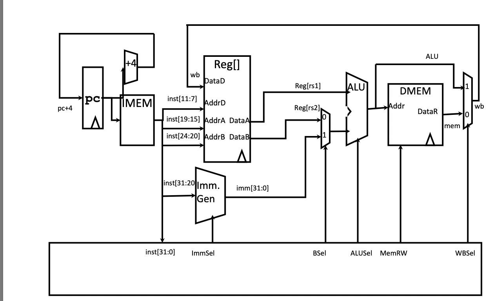

# Mini RISC-V CPU

## Overview
This project implements a simplified, RISC-V single-cycle CPU written in Verilog. Each instruction completes in a single clock cycle and the design includes instruction fetch, decode, execute, memory access, and write-back stages.

The purpose of this project was to gain hands-on experience with RTL design, CPU datapath construction, and waveform-based verification.

---

## Supported Instructions
The CPU supports the following instruction subset:

- ADD   (R-type): Register-to-register addition
- ADDI  (I-type): Register + immediate addition
- LW    (I-type): Load word from data memory
- SW    (S-type): Store word to data memory

---

## Datapath Design

### Datapath Reference Diagram
The following datapath diagram was used as the architectural reference for this CPU. All RTL modules were designed to directly correspond to the components shown in the diagram.



## Datapath Overview
Instruction execution follows this sequence:

1. Program Counter (PC) holds the current instruction address and increments by 1 each cycle.
2. Instruction Memory (IMEM) outputs a 16-bit instruction based on the PC.
3. The Register File reads rs1 and rs2 and writes results back to rd when enabled.
4. The Immediate Generator decodes and sign-extends immediates for I-type and S-type instructions.
5. The ALU performs arithmetic operations and computes addresses for load/store instructions.
6. Data Memory (DMEM) is accessed for LW and SW instructions.
7. A write-back multiplexer selects either the ALU result or memory output to write back to the register file.

---

## Project Structure
```
mini_riscv_cpu/
├── results/
│   └── cpu_tb.vcd              # Waveform output from simulation
├── rtl/
│   ├── alu.v                   # Arithmetic Logic Unit
│   ├── control.v               # Control unit (instruction decoder)
│   ├── cpu.v                   # Top-level CPU module
│   ├── dmem.v                  # Data memory
│   ├── imem.v                  # Instruction memory
│   ├── immgen.v                # Immediate generator
│   ├── pc.v                    # Program counter
│   └── regfile.v               # Register file
├── sim/
│   ├── cpu_sim                 # Compiled simulation executable
│   └── run.sh                  # Simulation run script
└── tb/
    └── cpu_tb.v                # CPU testbench
```

### Module Hierarchy

The CPU is organized hierarchically with `cpu.v` as the top-level module:
```
cpu (top-level)
├── pc                          # Program counter
├── imem                        # Instruction memory (16 words)
├── control                     # Control unit
├── regfile                     # Register file (8 registers: x0-x7)
├── immgen                      # Immediate generator
├── alu                         # Arithmetic Logic Unit (4-bit)
└── dmem                        # Data memory (16 words)
```

**Architecture Specifications:**
- **Data width**: 4 bits
- **Registers**: 8 general-purpose registers (x0-x7), with x0 hardwired to 0
- **Instruction memory**: 16 words
- **Data memory**: 16 words
- **Execution model**: Single-cycle (each instruction completes in one clock cycle)

**Module Descriptions:**
- **cpu.v**: Integrates all components and manages datapath connections
- **pc.v**: Maintains and increments the program counter
- **imem.v**: Stores and fetches 16-bit instructions
- **control.v**: Decodes opcodes and generates control signals
- **regfile.v**: Implements 8 general-purpose registers with dual read ports and one write port
- **immgen.v**: Extracts and sign-extends immediate values from instructions
- **alu.v**: Performs 4-bit arithmetic/logic operations (ADD, etc.)
- **dmem.v**: Provides 4-bit load/store memory interface

---

## Control Signals
The control unit decodes the instruction opcode and generates control signals that drive the datapath:

- ImmSel: Immediate selection (for ALU B input)
- RegWEn: Register file write enable
- BSel: Selects register or immediate as ALU operand B
- ALUSel: Selects ALU operation
- MemRW: Controls data memory read/write
- WBSel: Selects write-back data source

---

## Simulation and Verification

### Testbench
A Verilog testbench was written to:
- Generate clock and reset signals
- Load instructions into instruction memory
- Verify correct execution of arithmetic and memory instructions
- Observe internal datapath signals using waveforms

---

### Running the Simulation
To run the simulation:

1. Navigate to the simulation directory:
   cd sim

2. Make the run script executable:
   chmod +x run.sh

3. Run the simulation:
   ./run.sh

---

### Expected Output
During simulation, the testbench prints the internal CPU state at each rising clock edge.

**Format:**  
Time | PC | Instr | x1 x2 x3 x4 x5 | DMEM[2] DMEM[3]

**Expected output:**

| Time  | PC | Instr | x1 | x2 | x3 | x4 | x5 | DMEM[2] | DMEM[3] |
|-------|----|-------|----|----|----|----|----|---------|---------|
| 6000  | 0  | 1205  | 5  | x  | x  | x  | x  | 10      | 5       |
| 16000 | 1  | 1402  | 5  | x  | x  | x  | x  | 10      | 5       |
| 26000 | 2  | 2680  | 5  | 2  | x  | x  | x  | 10      | 5       |
| 36000 | 3  | 0858  | 5  | 2  | 10 | x  | x  | 10      | 5       |
| 46000 | 4  | 0b08  | 5  | 2  | 10 | 15 | x  | 10      | 5       |
| 56000 | 5  | 3541  | 5  | 2  | 10 | 15 | 4  | 10      | 5       |
| 66000 | 6  | 0000  | 5  | 2  | 10 | 15 | 4  | 10      | 5       |
| 76000 | 7  | 0000  | 5  | 2  | 10 | 15 | 4  | 10      | 5       |


**Notes:**
- `x` indicates registers that have not yet been written.
- PC increments sequentially as each instruction completes in one cycle.
- Data memory values confirm correct load and store behavior.


### Waveform Analysis
GTKWave was used to inspect internal CPU behavior during execution. The following signals were observed:

- Program counter (pc)
- Current instruction
- Register write enable
- ALU operand select
- ALU result
- Memory write enable
- Write-back data
- Destination register address

[INSERT GTKWave WAVEFORM SCREENSHOT HERE]


These signals demonstrate the full instruction lifecycle from fetch through write-back.

---

## Tools Used
- Verilog HDL
- Icarus Verilog
- GTKWave
- VS Code
- Git/Github

---

## Summary
This project demonstrates a complete single-cycle CPU implementation in Verilog, based on a RISC-V–style datapath. It highlights skills in hardware architecture, RTL design, control logic, and waveform-based verification.
